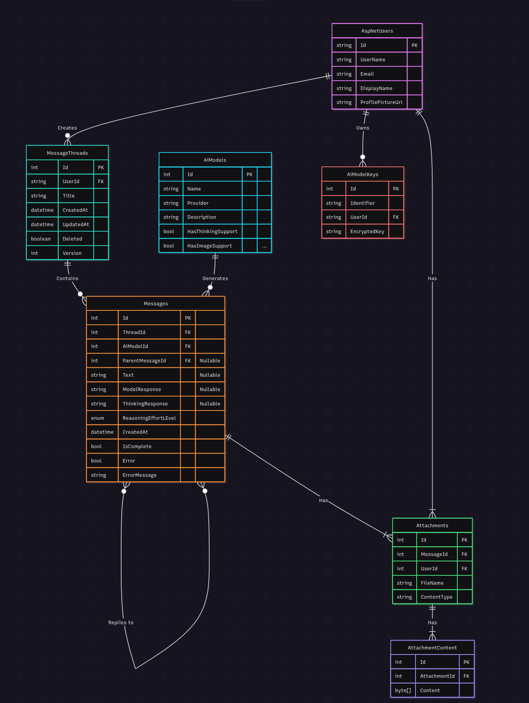
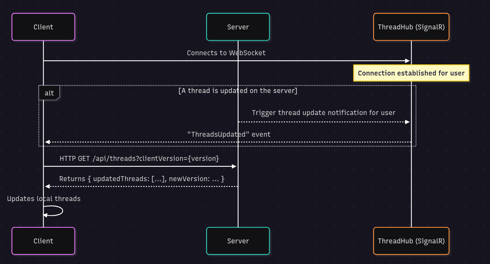
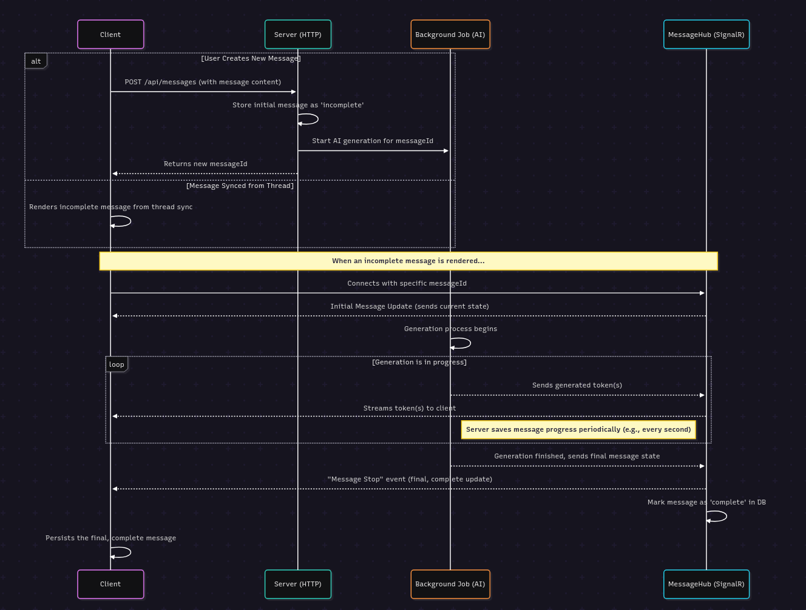

# LLMLab

This project is a web-based application for interacting with large language models (LLMs). It allows users to create and manage message threads, send messages, and receive responses from different AI models.

This Project was written for the T3 Chat Cloneathon https://t3.gg/chat-cloneathon

## Features

-   **Message Threads**: Create and manage threads for conversations with AI models.
-   **Message Syncing**: Sync messages between the server and client in real-time.
-   **Attachments**: Upload and attach files to messages.
-   **Syntax Highlighting**: Supports syntax highlighting for code snippets in messages.
-   **Message Streaming**: Send messages to AI models and receive responses in real-time.
-   **Resumable Streaming**: Continue receiving responses from AI models even after a connection is lost.
-   **Model Selection**: Choose from various AI models to interact with.
-   **Theme Support**: Light and dark themes for the user interface including a custom theme editor.
-   **Bring Your Own Keys**: Use your own API keys for different AI models.

## Tech Stack

-   **Backend**: ASP.NET Core 9.0, Entity Framework Core, SignalR
-   **Frontend**: Blazor WebAssembly, MudBlazor (used sparingly), plain HTML and CSS
-   **Database**: MSSQL (Dockerized for development using Aspire)

## Running the Project

Prerequisites:
*   .NET SDK (version 9.0 or later)
*   WASM Tools (for client-side WebAssembly support https://learn.microsoft.com/en-us/aspnet/core/blazor/webassembly-build-tools-and-aot?view=aspnetcore-9.0)
*   Docker (for running the MSSQL database)


1.  Clone the repository.
2.  Navigate to the `LLMLab.AppHost` directory.
3.  Run the command `dotnet run`.

This will start the application, including the Database, server and client.

4.  Open your web browser and navigate to `http://localhost:5000` to access the application.

## Publish the Project

To deploy the project, you need to publish the `LLMLab.Server` and `LLMLab.ClientWebServer` projects.

1.  Publish the server:
    ```bash
    dotnet publish -c Release
    ```
2.  Publish the client project:
    ```bash
    dotnet publish -c Release
    ```
you can add the -o option to specify the output directory for the published files, for example:
    ```bash
    dotnet publish LLMLab.Client -c Release -o ./publish
    ```
3.  (Optional) if you dont have a Server to host the client files you can use the `LLMLab.ClientWebServer` project to serve the client files. Publish it as well:
    ```bash
    dotnet publish -c Release
    ```
    Then Merge the Directories of the Client and ClientWebserver


## Configure the Project
1. You have to configure the `appsettings.Production.json` file in the `LLMLab.Server` project to set up your database connection string and other settings. Here is an example configuration:
```json
{
  "ConnectionStrings": {
    "DefaultConnection": "***"
  },
  "Logging": {
    "LogLevel": {
      "Default": "Information",
      "Microsoft": "Warning",
      "Microsoft.Hosting.Lifetime": "Information"
    }
  },
  "AppSettings": {
    "ClientUrl": "http://llmlab.chat",
    "ClientAfterLoginPath": "/afterLogin",
    "CookieDomain": ".llmlab.chat",
    "AllowedOrigins": [
      "https://llmlab.chat",
      "https://login.llmlab.chat"
    ],
    "EncryptionKey": "mu8Q97mF2jYiAZc8AfdK1w=="
  },
  "Authentication": {
    "Google": {
      "ClientId": "***",
      "ClientSecret": "***"
    }
  },
  "Mailgun": {
    "ApiKey": "***",
    "Domain": "mail.llmlab.chat",
    "From": "LLM Lab noreply@mail.llmlab.chat"
  }
}
```

Generate The EncryptionKey here https://generate-random.org/encryption-key-generator?count=1&bytes=8&cipher=aes-128-cbc&string=&password=

2. You also need to configure the `appsettings.json` file in the `LLMLab.Client` project to set up the client URL and other settings. Here is an example configuration:
```json
{
  "ServerUrl": "https://login.llmlab.chat"
}
```
unfortunately you have to do this for every Deployment as of right now on the Client Project, The Server Project only has to be configured once.

## Host the Published Files

You can then deploy the published artifacts to your hosting environment

1. Deploy the `LLMLab.Server` to your server environment and run it using this command:
    ```bash
    dotnet LLMLab.Server.dll --environment Production
    ```
2. Deploy the `LLMLab.ClientWebServer` to your server environment and run it using this command:
    ```bash
    dotnet LLMLab.ClientWebServer.dll --environment Production
    ```

## Database Model



There are also some Tables related to Asp.Net Core Identity and Hangfire but they are managed by libraries!

## Sync Models

The application uses SignalR for real-time communication between the server and the client. The following models are used for synchronization:

### Message Threads



### Message Streaming



### Settings

Settings to not get syncronised or stored on the Server, they are using a Key-Value store in the browser (localStorage) to persist the settings across sessions.